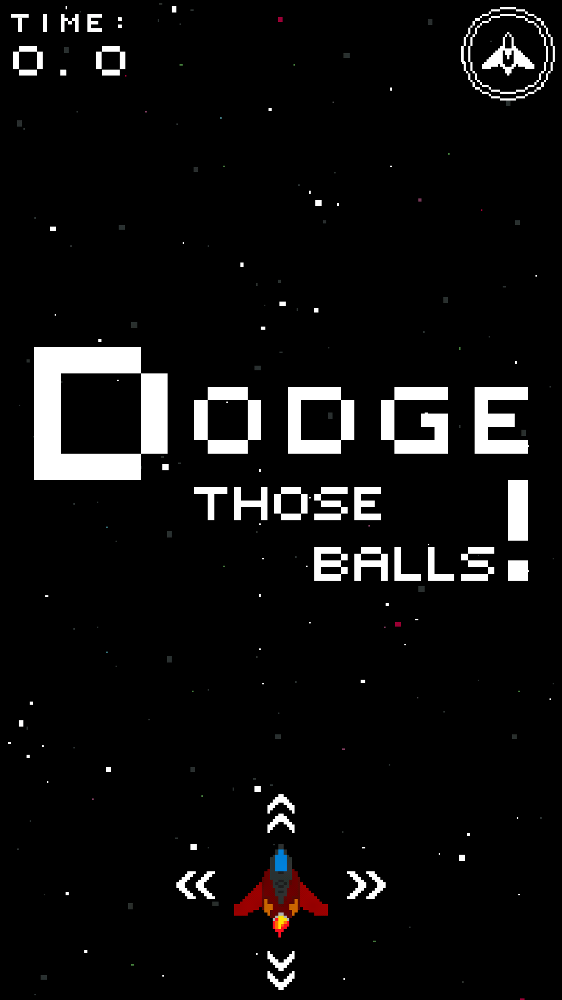
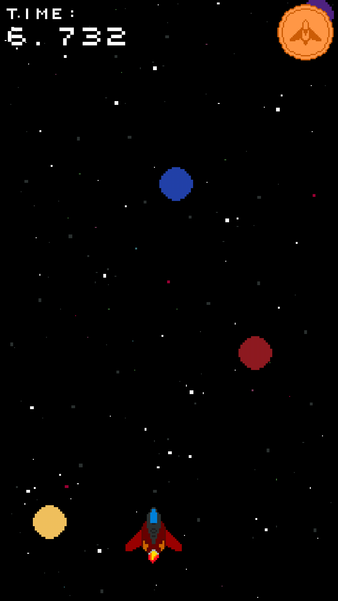
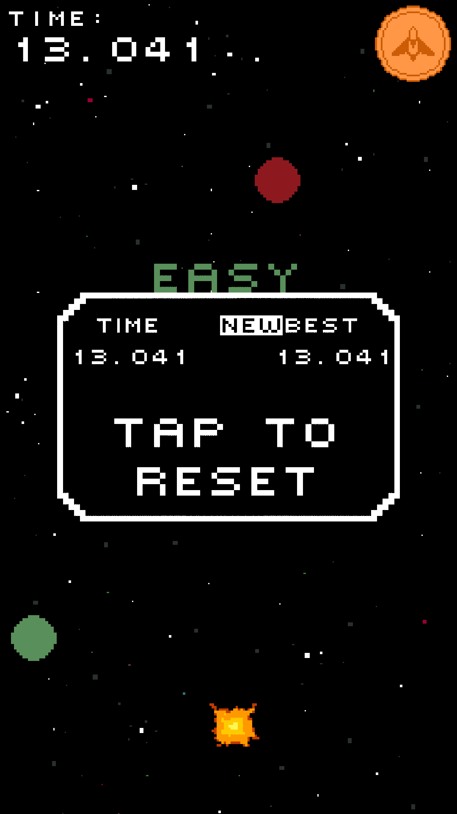

# Pixel Voyager
Simple game in which you have to avoid balls and survive as long as possible
<br/>
<p align="center">
  
  
  
</p>

### Download
All releases of the game are avaliable on the github page in the [releases](https://github.com/msuliborski/name/releases) tab. 
Game is also avaliable in [Google Play](https://play.google.com/store/apps/details?id=com.sulient.pixelvoyager)

## Getting Started
These instructions will get you a copy of the project up and running on your local machine for development and testing purposes. 

### Prerequisites
In order to properly build application one might need to install [Android Studio](https://developer.android.com/studio).

### Cloning
```
$ git clone https://github.com/msuliborski/pixel-voyager
```

### Building
Open project in Android Studio and install all dependencies needed. Currently project is compatible with Android 10 (SDK 29).
After opening project in Android Studio, in order to run game as native java application it is necessary to tweak run configuration. When project builds successfully and is indexed properly, one needs to navigate to `desktop/java/com.sulient.pixelvoyager`, right-click it and chose `Run:'DesktopLauncher.main()'`. After that, in top-right corner `Edit configurations...` and edit `Working directory` in such way it ends with `(...)/pixel-voyager/android/assets` instead of just `(...)/pixel-voyager`.

## Built with
* [Android Studio](https://developer.android.com/studio) - the fastest tools for building apps on every type of Android device.
* [LibGDX](https://libgdx.badlogicgames.com/) - Desktop/Android/BlackBerry/iOS/HTML5 Java game development framework

## Authors
* **Michał Suliborski** - [msuliborski](https://github.com/msuliborski)

## License
This project is licensed under the MIT License - see the [LICENSE.md](LICENSE.md) file for details
